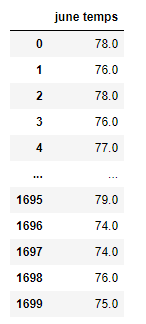
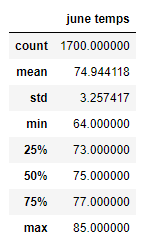
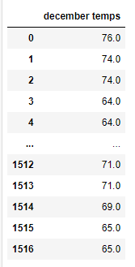
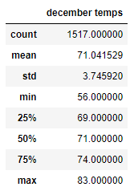
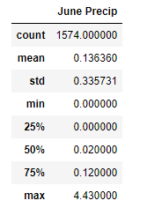
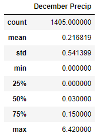

#  Overview: 
The purpose of the analysis is to provide temperature data for the months of June and December. This information will determine if opening a surf and ice cream shop would be sustainable all year round. 

# Results

## June Temps
	
* Looking at the list of the June temperatures, the temperature is consistently in the mid to upper 70's. 

 
* The June statistics table shows the average temperature is 74, the minimum is 64 and the maximum is 85.

## December Temps

* The temperature for the month of December fluctuates between the mid to upper 60's and upper to mid 70's.

* The December statistics show the average temperature is 71, the minimum is 56 and the maximum is 83	

	
# Summary

It looks like June and December have the ideal temperatures to have a surf and ice cream shop in Oahu. June has consistent warm weather that is idyllic for surfing and enjoying ice cream. December has slightly lower temperatures but that should not affect surfing, it could however, have an impact on ice cream sales. It is something to consider when replenishing ice cream inventory for December.

	
Besides the temperatures, it is also important to consider the precipitation for both months. An additional analysis for June shows the average precipitation for the month is 0.13 and 0.21 for December. The maximum for June is 4.43 and 6.42 for December, overall the precipitation is minimal and the surf and ice cream shop should be able to remain open for the majority of both months. 

   
	

